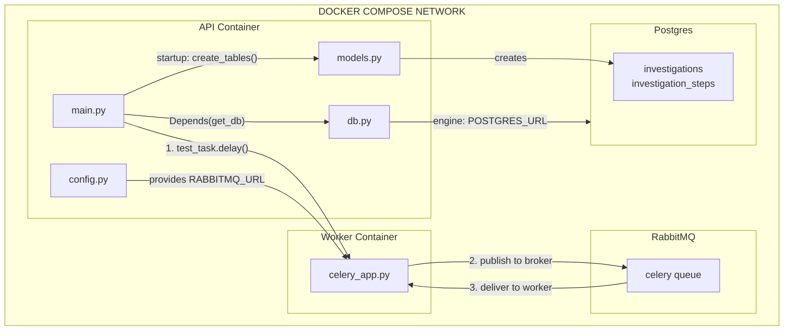

# Infrastructure Flow

```mermaid
flowchart LR
    subgraph DC["DOCKER COMPOSE NETWORK"]
        direction LR
        
        subgraph API["API Container"]
            MAIN["main.py"]
            DB["db.py"]
            CFG["config.py"]
            MODELS["models.py"]
        end
        
        subgraph WRK["Worker Container"]
            CELERY["celery_app.py"]
        end
        
        subgraph RMQ["RabbitMQ"]
            QUEUE["celery queue"]
        end
        
        subgraph PG["Postgres"]
            TABLES["investigations<br/>investigation_steps"]
        end
    end

    MAIN -->|"startup: create_tables()"| MODELS
    MODELS -->|"creates"| TABLES
    MAIN -->|"Depends(get_db)"| DB
    DB -->|"engine: POSTGRES_URL"| PG
    
    CFG -->|"provides RABBITMQ_URL"| CELERY
    
    MAIN -->|"1. test_task.delay()"| CELERY
    CELERY -->|"2. publish to broker"| QUEUE
    QUEUE -->|"3. deliver to worker"| CELERY
```